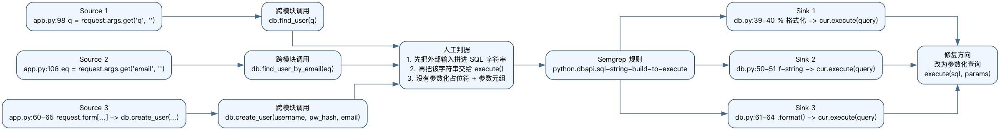

# Semgrep 作业报告

- 学号: 25140919
- 姓名: 杨昌业
- 目标仓库: `semgrep-homework/code-repo`
- 自写规则: `semgrep-homework/rules/python-dbapi-sql-string-build.yaml`
- 扫描约束: 仅使用本人编写的规则文件运行 `semgrep -c`

## 1. 人工源码分析范围

本次人工分析重点阅读了 `code-repo/app.py` 和 `code-repo/db.py`。

- `app.py` 中存在多处来自 Flask `request.args` / `request.form` 的不可信输入。
- `db.py` 中负责真正拼接 SQL 并调用 `sqlite3` 游标的 `execute()`。
- 这类问题适合用 Semgrep 表达，因为坏模式在多个函数中重复出现，且结构清晰稳定。

## 2. 选定漏洞与原因

我选择的漏洞类型是 Python DB-API 中的 SQL 注入风险，即:

- 先使用 Python 字符串插值把变量拼进 SQL 语句。
- 再把这条 SQL 字符串传给 `cursor.execute(...)`。
- 没有使用参数化查询的占位符和参数元组。

之所以适合用 Semgrep 规则表达，原因如下:

- 这是重复坏模式，不依赖运行时环境即可从源码结构稳定识别。
- 三种常见写法 `%`、`f-string`、`.format()` 都在该仓库同时出现，适合收敛成一个 `pattern-either` 规则。
- 与“仅人工读一处”不同，规则可以复用到其它同类函数，验证人工结论是否可重复。

## 3. Source 到 Sink 的人工追踪

### 3.1 `/users` 查询用户名

- Source: `app.py:98` 中 `q = request.args.get("q", "")`
- 跨模块调用: `app.py:102` 中 `db.find_user(q)`
- Sink: `db.py:39-40` 中先构造 `query = "SELECT * FROM users WHERE username = '%s'" % username`，再 `cur.execute(query)`

### 3.2 `/users` 查询邮箱

- Source: `app.py:106` 中 `eq = request.args.get("email", "")`
- 跨模块调用: `app.py:108` 中 `db.find_user_by_email(eq)`
- Sink: `db.py:50-51` 中先构造 `query = f"SELECT * FROM users WHERE email = '{email}'"`，再 `cur.execute(query)`

### 3.3 `/register` 注册用户

- Source: `app.py:60-62` 中 `username/password/email = request.form[...]`
- 跨模块调用: `app.py:65` 中 `db.create_user(username, pw_hash, email)`
- Sink: `db.py:61-64` 中先构造 `.format()` SQL，再 `cur.execute(query)`

## 4. 规则的“合适触发”判据

我把规则触发条件定义为以下三点同时成立:

- 存在一个变量被赋值为 SQL 字符串插值结果，具体包括 `%`、`f-string`、`.format()`。
- 该变量随后被传给某个对象的 `execute()` 方法作为 SQL 语句。
- 代码没有使用参数化查询的安全形态 `execute(sql, params)`。

这一定义可以覆盖本仓库中的三处命中，同时避免把常量 SQL 或参数化查询误报为漏洞。

## 5. 流程图



## 6. 自写规则

规则文件路径: `semgrep-homework/rules/python-dbapi-sql-string-build.yaml`

```yaml
rules:
  - id: python.dbapi.sql-string-build-to-execute
    message: Potential SQL injection: SQL is built with Python string interpolation and then passed into execute(). Use parameterized queries instead.
    languages: [python]
    severity: ERROR
    patterns:
      - pattern-either:
          - patterns:
              - pattern: |
                  $QUERY = "..." % ...
                  ...
                  $CUR.execute($QUERY)
          - patterns:
              - pattern: |
                  $QUERY = f"...{...}..."
                  ...
                  $CUR.execute($QUERY)
          - patterns:
              - pattern: |
                  $QUERY = "...".format(...)
                  ...
                  $CUR.execute($QUERY)
```

## 7. 最小测试

最小测试文件路径: `semgrep-homework/tests/python_dbapi_sql_string_build_cases.py`

测试目标:

- `bad_percent`、`bad_fstring`、`bad_format` 应被命中。
- `ok_parameterized_select`、`ok_parameterized_insert`、`ok_constant_query` 不应被命中。

我没有使用 Semgrep 官方规则包，也没有使用 `p/owasp-top-ten` 等现成配置。

## 8. 扫描命令

### 8.1 规则最小测试

```bash
HOME=$PWD/semgrep-homework/.semgrep-home \
SSL_CERT_FILE=/etc/ssl/cert.pem \
SEMGREP_SEND_METRICS=off \
SEMGREP_ENABLE_VERSION_CHECK=0 \
semgrep scan \
  -c semgrep-homework/rules/python-dbapi-sql-string-build.yaml \
  semgrep-homework/tests/python_dbapi_sql_string_build_cases.py
```

### 8.2 对 `code-repo` 扫描

```bash
HOME=$PWD/semgrep-homework/.semgrep-home \
SSL_CERT_FILE=/etc/ssl/cert.pem \
SEMGREP_SEND_METRICS=off \
SEMGREP_ENABLE_VERSION_CHECK=0 \
semgrep scan \
  -c semgrep-homework/rules/python-dbapi-sql-string-build.yaml \
  semgrep-homework/code-repo
```

## 9. 扫描结论

- 命中位置: `db.py:39-40`、`db.py:50-51`、`db.py:61-64`
- 实际结果摘要: 最小测试扫描 1 个文件命中 3 处；对 `code-repo` 扫描 3 个目标文件，命中 3 处。
- 与人工分析是否一致: 一致。人工分析先锁定 `app.py` 中的外部输入，再定位到 `db.py` 中三种 SQL 拼接模式，Semgrep 结果全部覆盖。
- 可能漏报: 如果未来代码先在辅助函数里构造 SQL，再间接传给 `execute()`，当前规则可能因为缺少更深的数据流建模而漏掉。
- 可能误报: 如果某些 `.execute()` 不是数据库执行接口，或字符串虽然使用插值但输入来源完全可信，当前规则仍可能给出保守告警。

## 10. 修复建议

推荐将以下不安全写法:

```python
query = "SELECT * FROM users WHERE username = '%s'" % username
cur.execute(query)
```

替换为参数化查询:

```python
query = "SELECT * FROM users WHERE username = ?"
cur.execute(query, (username,))
```

对插入语句同样应改为:

```python
cur.execute(
    "INSERT INTO users (username, pw_hash, email) VALUES (?, ?, ?)",
    (username, pw_hash, email),
)
```

## 11. 提交物清单

- `semgrep-homework/code-repo/`: 作业使用的小型真实仓库副本
- `semgrep-homework/rules/`: 全部自写规则
- `semgrep-homework/tests/`: 最小测试用例
- `semgrep-homework/artifacts/rule-test-output.txt`: 规则最小测试输出
- `semgrep-homework/artifacts/scan-output.txt`: 仅使用自写规则扫描仓库的输出
- `semgrep-homework/report/semgrep_homework_25140919_yangchangye.md`: 完整 Markdown 报告
- `semgrep-homework/report/semgrep_homework_25140919_yangchangye.pdf`: PDF 版本
